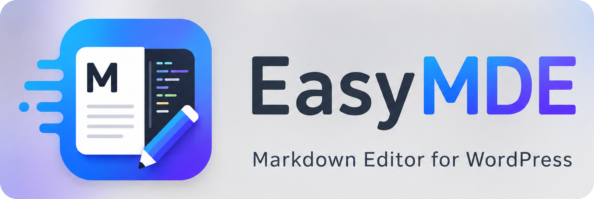
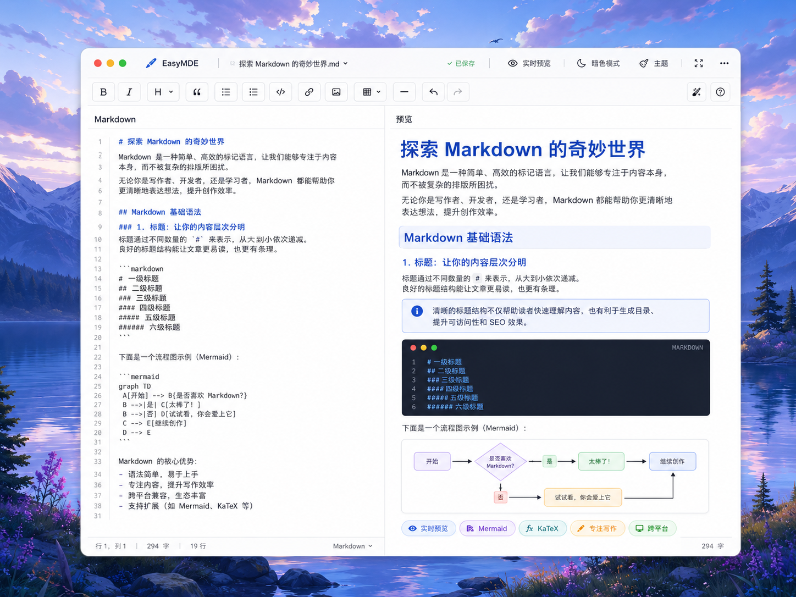

<p align="center">
  <a href="./docs/assets/easymde-logo-rounded.png">
    
  </a>
</p>
<h1 align="center">EasyMDE</h1>
<p align="center">From Markdown to WordPress, without breaking your flow.</p>
<p align="center">
  <a href="https://github.com/tao-xiaoxin/EasyMDE/releases">
    
  </a>
  
  
  <a href="https://github.com/tao-xiaoxin/EasyMDE/actions/workflows/ci.yml">
    
  </a>
  <a href="./LICENSE">
    
  </a>
</p>

<p align="center">English | <a href="README.zh-CN.md">简体中文</a></p>

<p align="center">
  <a href="./docs/assets/easymde-editor-showcase.png">
    
  </a>
</p>

EasyMDE is a standalone WordPress Markdown editor plugin. When the plugin is active, new and existing WordPress posts and pages open in EasyMDE through the normal WordPress editor entry points. Opening an ordinary existing post does not convert or write anything until the author saves from EasyMDE.

EasyMDE stores Markdown as the source of truth, saves rendered HTML to `post_content` for WordPress compatibility, uses WordPress media/revisions/permissions/publishing flows, and ships local runtime assets instead of requiring Jetpack, Classic Editor, another Markdown plugin, or CDN-hosted editor/rendering libraries.

## Requirements

- WordPress 6.7 or newer.
- PHP 7.4 or newer.
- Composer runtime dependencies included in production release ZIPs.

## Installation

1. Download an EasyMDE release ZIP from [GitHub Releases](https://github.com/tao-xiaoxin/EasyMDE/releases), or place the plugin folder at `wp-content/plugins/easymde`.
2. In WordPress, go to **Plugins > Add New > Upload Plugin** for the ZIP, or activate the copied plugin from **Plugins**.
3. Open or create content from the normal WordPress **Posts** and **Pages** screens.
4. Supported posts and pages open in EasyMDE. Existing EasyMDE posts keep using stored Markdown metadata, while ordinary posts use an in-memory Markdown import of current `post_content` until first save.

## Features

**Writing workflow**

- Split Markdown source editor and live preview.
- Scroll synchronization between source and preview panes.
- Compact icon toolbar for common Markdown actions.
- Typora-inspired keyboard shortcuts with site-wide Windows/Linux and macOS overrides.
- WordPress media library image insertion, plus local clipboard paste and drag-and-drop image upload.
- Browser local draft recovery with explicit restore, discard, and cross-tab conflict handling.
- Outline navigation, writing statistics, responsive edit/split/preview layouts, publishing controls, and revision navigation in the ordinary editor.

**Rendering**

- Server-side Markdown rendering with `league/commonmark`.
- Raw Markdown HTML stripped and final HTML sanitized before output.
- Local Highlight.js, Mermaid, and KaTeX assets.
- `[TOC]` and `[toc]` table of contents support.

**Appearance**

- Per-post article themes and code themes.
- Fixed CSS-only Mac-style frame for rendered code blocks, loaded only when code content needs it.
- Per-post article font stack selection.
- Named per-user custom CSS styles, scoped and parsed before use.

**WordPress integration**

- EasyMDE editor mode for new and existing supported post types.
- Metadata-based document state for Markdown source, rendering settings, and compatibility output.
- Rendered HTML saved to `post_content` for themes, feeds, search, and plugin compatibility.
- EasyMDE Markdown and appearance metadata included in WordPress revisions.
- Frontend pages load only the selected theme and the feature assets required by the current post.

**Publishing and export**

- Frontend rendering from stored Markdown when EasyMDE is active.
- Rich-text **Copy to WeChat** export from the current preview when browser clipboard support allows it.

## Documentation

- [Documentation index](docs/README.md)
- [User guide](docs/USER_GUIDE.md)
- [Development setup](docs/DEVELOPMENT.md)
- [Testing and release](docs/TESTING_AND_RELEASE.md)
- [Architecture](docs/ARCHITECTURE.md)
- [Plugin Check notes](docs/PLUGIN_CHECK.md)
- [Upgrade notes](UPGRADING.md)
- [Security policy](SECURITY.md)
- [Contributing guide](CONTRIBUTING.md)
- [WordPress package readme](readme.txt)
- [Third-party notices](THIRD-PARTY-NOTICES.md)

## Development

Start with:

```bash
composer install
npm install
npm run assets:check
```

Highlight.js, Mermaid, and KaTeX are sourced from locked npm packages, prepared explicitly under `assets/vendor/` only when their dependency or manifest changes, committed, and shipped with the plugin. Runtime requests stay local; CI and release builds use the read-only asset check and fail on missing, changed, or unexpected managed files. See [Development](docs/DEVELOPMENT.md) and [Testing and Release](docs/TESTING_AND_RELEASE.md) before changing runtime code, release packaging, or tests.

## Support EasyMDE

<p align="center">
  If EasyMDE improves your WordPress writing flow, a star helps more writers discover the project.
</p>

## Star History

<p align="center">
  <a href="https://star-history.com/#tao-xiaoxin/EasyMDE&Date">
    
  </a>
</p>

## License

EasyMDE is licensed under [Apache-2.0](LICENSE).
