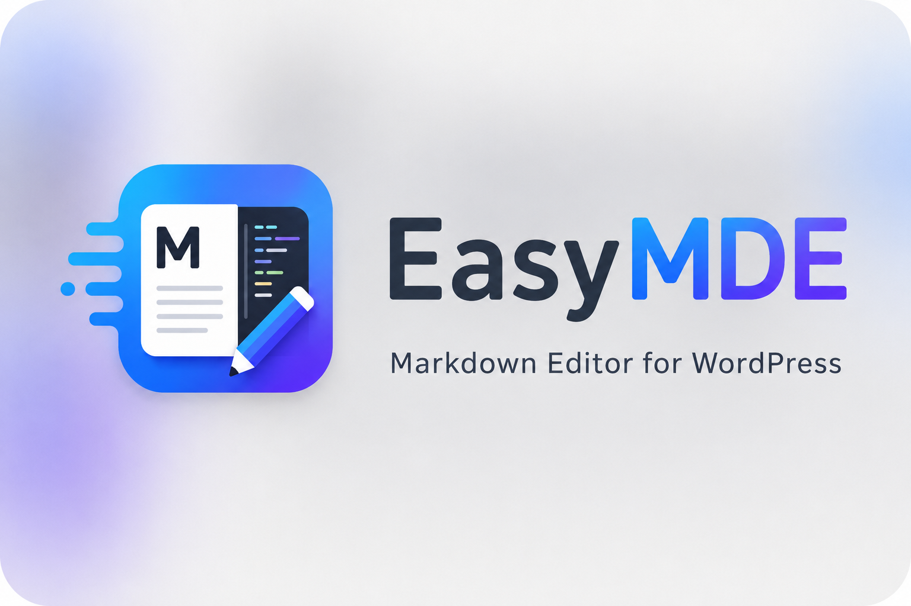

<p align="center">
  
</p>

# EasyMDE

EasyMDE is a full-featured WordPress Markdown editor plugin focused on a clean split-pane writing experience: Markdown source on the left, live preview on the right, and enough extension points to grow into a serious publishing tool.

The project name is EasyMDE, but the goal is broader than wrapping one editor library. The plugin should provide a self-contained WordPress Markdown workflow without depending on Jetpack, Classic Editor, or another Markdown plugin.

## Goals

- Provide a modern Markdown editor for WordPress posts and pages.
- Support split-pane live preview with scroll sync.
- Keep Markdown as the primary authoring format.
- Work as one standalone WordPress plugin.
- Store and render content predictably, without hijacking unrelated admin pages.
- Make toolbar buttons and shortcode helpers extensible through compatibility APIs.
- Keep assets local by default instead of relying on external CDNs.

## Non-Goals

- Do not depend on Jetpack Markdown.
- Do not require Classic Editor as a separate plugin.
- Do not globally replace or redirect unrelated WordPress admin pages.
- Do not convert every post into Gutenberg blocks as the primary workflow.
- Do not ship a large page-builder experience.

## Planned Architecture

```text
WordPress Plugin
├── PHP plugin bootstrap
├── Admin editor integration
├── Markdown storage and render pipeline
├── Frontend content rendering
├── Local editor assets
└── Extension APIs
```

Recommended foundation:

- Editor UI: TOAST UI Editor, or another modern editor that supports Markdown source editing, live preview, toolbar customization, and extension hooks.
- Server rendering: `league/commonmark` for predictable CommonMark/GFM-compatible output.
- Sanitization: WordPress escaping and allowlist APIs, such as `wp_kses_post`, with plugin-specific hardening where needed.

## Core Features

Initial target:

- Markdown source editor.
- Split-pane live preview.
- Scroll synchronization.
- Toolbar for common Markdown actions.
- WordPress media insertion.
- Autosave-friendly content handling.
- Markdown rendering on the frontend.
- Per-post Markdown metadata where needed.

Later features:

- Custom toolbar button registry.
- Shortcode helper buttons.
- Code block enhancements.
- Copy button for code blocks.
- Table helpers.
- Image upload and URL replacement helpers.
- Obsidian-style link helpers.
- Import path from WP Editor.md-style content.

## Extension Direction

The plugin should expose internal registration APIs instead of forcing every feature into the core editor:

```php
EasyMDE_Plugin::register_toolbar_button(...);
EasyMDE_Plugin::register_shortcode_helper(...);
```

These compatibility APIs delegate to namespaced registries internally. The
important constraint is that new features should be added through stable hooks
or registries, not by patching editor internals.

## Safety Principles

- Admin integration must be scoped to intended editor screens only.
- Plugin activation must not redirect every admin request to a settings page.
- Frontend rendering must sanitize generated HTML.
- External network assets should be avoided by default.
- Existing WordPress content should not be destructively rewritten.

## Status

This repository is in early MVP development.

Current implementation:

- Standalone WordPress plugin bootstrap.
- Scoped post/page editor integration.
- Block editor disabled only for posts explicitly enabled for EasyMDE, including legacy posts with stored EasyMDE Markdown.
- Split Markdown source and preview panes.
- Compact icon toolbar for common Markdown actions.
- Typora-inspired keyboard shortcuts with site-wide overrides.
- WordPress media insertion button.
- REST-powered server preview endpoint.
- Browser local draft autosave and restore prompt.
- Right-side "Copy to WeChat" rich-text export action.
- Dark mode toggle for the editor surface.
- Temporary immersive writing mode that expands the editor over the WordPress edit screen.
- Local highlight.js code highlighting.
- Per-post Markdown theme selection, including the full Markdown2Html-style article theme set.
- Per-post code theme selection with local highlight.js styles.
- Optional local CSS-only Mac-style code frame.
- Named per-user custom CSS styles that can be reused on new posts.
- Local Mermaid diagram rendering.
- Local KaTeX math rendering.
- `[TOC]` / `[toc]` table of contents generation.
- Markdown source stored in `_easymde_markdown`.
- EasyMDE mode stored in `_easymde_enabled`, with lazy compatibility for legacy `_easymde_markdown` posts.
- Rendered HTML saved into `post_content`.
- Frontend content rendered from stored Markdown when available.
- Settings page for status plus shortcut configuration, with no activation redirect.

## Themes and Custom CSS

The editor uses a compact icon toolbar instead of large text buttons. Common
formatting actions stay in the top bar, headings move into a popover, and theme
and font controls live in compact popovers so the writing surface keeps more
room for source and preview. Theme and font choices are still saved per post,
and the most recent choices are also saved as the current user's defaults for
new posts.

The toolbar includes an immersive writing toggle. It temporarily expands the
EasyMDE editor over the WordPress edit screen so the Markdown source and live
preview can use the full viewport. The mode is session-only: refreshing or
opening another post returns to the normal WordPress editor layout.

EasyMDE ships with Typora-inspired shortcut defaults for formatting, headings,
lists, code, links, images, saving, and WeChat copy. Administrators can change
the Windows/Linux and macOS bindings independently from the plugin settings
screen.

The built-in default code presentation is `atom-one-dark` with the CSS-only
Mac-style frame enabled, so code blocks use the expected dark `#282c34`
background before and after highlight.js enhancement.

Custom CSS styles can be saved with a user-provided name. Saved styles are kept
in user meta and can be selected again on later posts. When a post uses a custom
style, EasyMDE stores a sanitized CSS snapshot with the post so published content
keeps the same appearance even if the user later edits or removes the library
entry.

Custom CSS is scoped to EasyMDE-rendered content and is sanitized before storage.
Remote CSS imports and `url(...)` values are stripped so the editor and frontend
do not depend on external assets by default.

The font popover builds an mdnice-compatible fallback stack from custom Latin
fonts, Windows fonts, Apple fonts, and a serif/sans-serif final fallback. System
font names such as Optima, Microsoft YaHei, PingFang, Cochin, and Helvetica Neue
are tried when the visitor's device has them installed. The selected stack is
applied to rendered article text in the editor preview and on the frontend while
code remains monospace.

The built-in article themes include the Markdown2Html-style set: default,
orange-heart, chazi-purple, nenqing-green, green-vitality, red-crimson,
blue-ying, lanqing, yamabuki, grid-black, geek-black, rose-purple,
ningye-purple, tech-blue, cute-green, fullstack-blue, minimal-black,
orange-blue, frontend-peak, and cupid-busy. They style
colors, heading treatments, typography, blockquotes, inline code, lists, tables,
image presentation, table of contents, and math blocks through scoped CSS.

These themes are local CSS recreations based on Markdown2Html visual references.
The plugin does not copy GPL-licensed Markdown2Html source files or load remote
decorative theme images.

## WeChat Copy

The editor includes a right-side **Copy to WeChat** action that copies the
current preview as rich text. EasyMDE clones the rendered preview, inlines the
computed styles for core typography, code, tables, and images, then writes both
`text/html` and `text/plain` clipboard payloads when the browser allows it.

If the browser does not expose rich-text clipboard APIs, EasyMDE falls back to
older copy mechanisms when available and otherwise shows a non-destructive error
message instead of silently failing.

## Development

Install PHP dependencies when Composer is available:

```bash
composer install
```

`league/commonmark` is the only Markdown renderer. A development checkout
without Composer dependencies shows an administrator notice and avoids writing
new fallback HTML. Production release packages must include Composer
dependencies in `vendor/`.

Install local frontend assets for highlighting, Mermaid, and KaTeX:

```bash
npm install
```

This copies runtime assets into `assets/vendor/`. Do not commit `node_modules`.
The copied highlight.js styles include `github`, `github-dark`,
`atom-one-dark`, `atom-one-light`, `monokai`, `vs2015`, and `xcode` under
`assets/vendor/highlight/styles/`; the `wechat-inspired` style is maintained
locally in `assets/themes/code/`.

EasyMDE uses the standard WordPress text domain `easymde`. GitHub Release ZIPs
include the bundled Simplified Chinese language files in `languages/`, including
`easymde.pot`, `easymde-zh_CN.po`, and the gettext-compiled
`easymde-zh_CN.mo`.

Update and validate translation files with:

```bash
npm run i18n:make-pot
npm run i18n:compile
npm run i18n:check
```

These commands require GNU gettext tools such as `xgettext` and `msgfmt`.
Running `npm install` installs JavaScript dependencies and copies local runtime
assets, but it does not rewrite translation files.

Build the installable release package with:

```bash
npm run build:release
```

The release build creates `dist/easymde` and `dist/easymde.zip`. It validates
that the package is self-contained with Composer `vendor/`, `assets/vendor/`,
article and code themes, templates, source files, local Mermaid, KaTeX,
Highlight.js assets, KaTeX CSS/fonts, and bundled language files. It also checks
that `easymde.php`, `EASYMDE_VERSION`, `readme.txt`, and `package.json` all
carry the same version. The plugin does not require remote CDN assets.

To test in WordPress, copy or symlink this repository into:

```text
wp-content/plugins/easymde
```

Then activate **EasyMDE** in the WordPress plugins screen.

For local Docker testing:

```bash
cp .env.example .env
docker compose up -d
```

Open:

```text
http://localhost:8088
```

The Docker test site is initialized with WordPress `6.9` and Simplified Chinese
(`zh_CN`) by default. The plugin header declares WordPress `6.0` as the minimum
supported version.
Set the local administrator and database passwords in `.env`; do not commit that
file.

Useful checks inside the Docker environment:

```bash
docker compose exec -T wordpress php -l wp-content/plugins/easymde/easymde.php
docker compose exec -T wordpress sh -lc 'find wp-content/plugins/easymde/src wp-content/plugins/easymde/templates -name "*.php" -print0 | xargs -0 -n1 php -l'
```

When documenting test results, use placeholder values from `.env.example` and do
not record real local paths, passwords, database credentials, REST nonces,
cookies, or administrator secrets.

To reinstall the local test site from scratch:

```bash
docker compose down -v
docker compose up -d
```
