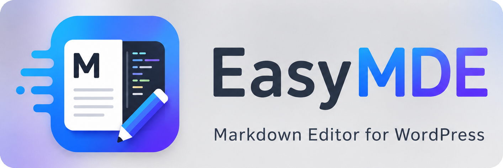
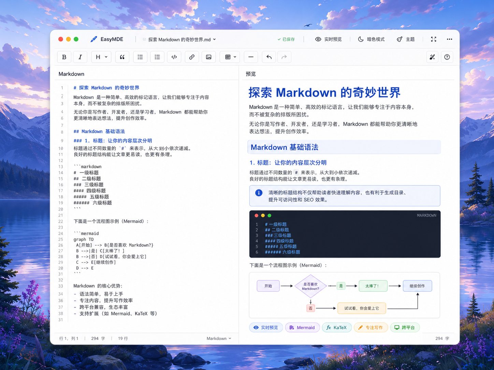

<p align="center">
  <a href="./docs/assets/easymde-logo-rounded.png">
    
  </a>
</p>
<h1 align="center">EasyMDE - WordPress Markdown 编辑器插件</h1>
<p align="center">独立的 WordPress Markdown 编辑器插件，从 Markdown 到 WordPress，不打乱你的写作流程。</p>
<p align="center">
  <a href="https://github.com/tao-xiaoxin/EasyMDE/releases">
    
  </a>
  
  
  <a href="https://github.com/tao-xiaoxin/EasyMDE/actions/workflows/ci.yml">
    
  </a>
  <a href="./LICENSE">
    
  </a>
</p>

<p align="center">简体中文 | <a href="README.en.md">English</a></p>

EasyMDE 是一个独立的 WordPress Markdown 编辑器插件。它让新的和现有的受支持 WordPress 内容通过正常的 WordPress 编辑入口使用 EasyMDE。

<p align="center">
  <a href="https://github.com/tao-xiaoxin/EasyMDE/releases/latest/download/EasyMDE.zip"><strong>下载最新可安装插件包 EasyMDE.zip</strong></a>
  · <a href="https://github.com/tao-xiaoxin/EasyMDE/releases/latest">查看发布说明</a>
</p>

<p align="center">
  <a href="./docs/assets/easymde-editor-showcase.png">
    
  </a>
</p>

打开普通的现有内容是零写操作：在作者通过 EasyMDE 保存前，不会转换、写入元数据、改写 `post_content` 或创建修订版本。

EasyMDE 将 Markdown 作为事实来源，将渲染后的 HTML 保存到 `post_content` 以兼容 WordPress，使用 WordPress 的媒体、修订版本、权限和发布流程，并提供本地运行时资源，不要求 Jetpack、Classic Editor、其他 Markdown 插件或由 CDN 托管的编辑器和渲染库。

插件的 JavaScript、CSS、字体、图标和渲染库始终随插件本地打包。管理员还可以配置图床，用于作者粘贴或拖放本地图片。

## 要求

- WordPress 6.7 或更高版本。
- PHP 7.4 或更高版本，并启用 DOM 扩展。
- 正式发布的 `EasyMDE.zip` 包含 Composer 运行时依赖。

## 安装

1. 下载上方链接指向的 GitHub Release 资产 `EasyMDE.zip`。GitHub 自动生成的 Source code ZIP/TAR.GZ 是源码归档，不是可安装插件，不能用于安装。
2. 在 WordPress 中进入 **插件 > 安装插件 > 上传插件**，上传并安装 `EasyMDE.zip`，然后启用插件。
3. 从 WordPress 正常的 **文章**、**页面**或其他受 `easymde_supported_post_types` 支持的文章类型页面打开或创建内容。
4. 受支持的内容会在 EasyMDE 中打开。已有 EasyMDE 元数据的内容继续使用已存储的 Markdown；普通内容会在第一次保存前，将当前 `post_content` 在内存中导入为 Markdown。

## 功能

**写作流程**

- 分栏 Markdown 源文档编辑器和实时预览。
- 源文档与预览窗格滚动同步。
- 用于常见 Markdown 操作的紧凑图标工具栏。
- 受 Typora 启发的快捷键，并支持站点级 Windows/Linux 和 macOS 覆盖设置。
- 通过工具栏媒体选择器明确插入 WordPress 媒体库内容。
- 可选的受保护图床上传，用于本地图片粘贴和拖放；管理员可配置 Cloudflare R2、七牛云 Kodo、阿里云 OSS 或腾讯云 COS。
- 浏览器本地草稿恢复支持明确恢复、丢弃和跨标签页冲突处理。
- 固定的 50/50 桌面端源文档/预览工作区，以及窄屏下的历史响应式堆叠布局。
- WordPress 原生发布、分类、标签、摘要、特色图片和修订版本继续在现有 Meta Box 中提供。

**渲染**

- 使用 `league/commonmark` 在服务端渲染 Markdown。
- 剥离原始 Markdown HTML，并在输出前清理最终 HTML。
- 本地 Highlight.js、Mermaid 和 KaTeX 资源。
- 支持 `[TOC]` 和 `[toc]` 目录。

**外观**

- 每篇文章独立选择文章主题和代码主题。
- 配置中心默认将编辑器选定的外观应用于已发布内容。关闭此联动后，选定外观仅用于编辑器预览，公开内容使用 EasyMDE 的中性默认外观。
- 渲染代码块使用固定的纯 CSS Mac 风格代码框，仅在内容需要代码时加载。
- 已发布的代码块默认显示复制按钮；配置中心可以关闭该控件，但不会禁用代码渲染或语法高亮。
- 每篇文章独立选择文章字体栈。
- 命名的按用户隔离的自定义 CSS 样式，使用前会先限制范围并解析。

**WordPress 集成**

- 为新的和现有的受支持文章类型提供 EasyMDE 编辑模式。
- 通过元数据保存 Markdown 源文档、渲染设置和兼容输出的文档状态。
- 将渲染后的 HTML 保存到 `post_content`，供主题、Feed、搜索和插件兼容使用。
- EasyMDE Markdown 和外观元数据纳入 WordPress 修订版本。
- 前台页面只加载当前文章选定的主题和所需功能资源。

**发布与导出**

- EasyMDE 启用时，根据已存储的 Markdown 在前台渲染。
- 在浏览器支持剪贴板时，从当前预览导出富文本 **复制到微信**。

## 技术文档

- [文档索引](docs/README.md)
- [用户指南](docs/USER_GUIDE.md)
- [开发设置](docs/DEVELOPMENT.md)
- [测试与发布](docs/TESTING_AND_RELEASE.md)
- [架构](docs/ARCHITECTURE.md)
- [Plugin Check 说明](docs/PLUGIN_CHECK.md)
- [升级说明](UPGRADING.md)
- [安全策略](SECURITY.md)
- [贡献指南](CONTRIBUTING.md)
- [WordPress 软件包 readme](readme.txt)
- [第三方声明](THIRD-PARTY-NOTICES.md)

## 开发

从以下命令开始：

```bash
composer install
npm install
npm run assets:check
```

Highlight.js、Mermaid 和 KaTeX 来自锁定的 npm 包；只有依赖或资源清单发生变化时，才会在 `assets/vendor/` 下显式准备、提交并随插件发布。运行时请求保持本地；CI 和发布构建使用只读资源检查，并在托管文件缺失、更改或出现额外文件时失败。修改运行时代码、发布打包或测试前，请参阅 [开发](docs/DEVELOPMENT.md) 和 [测试与发布](docs/TESTING_AND_RELEASE.md)。

## 支持 EasyMDE

<p align="center">
  如果 EasyMDE 改善了你的 WordPress 写作流程，点亮 Star 可以帮助更多作者发现这个项目。
</p>

## 许可证

EasyMDE 使用 [Apache-2.0](LICENSE) 许可证。
