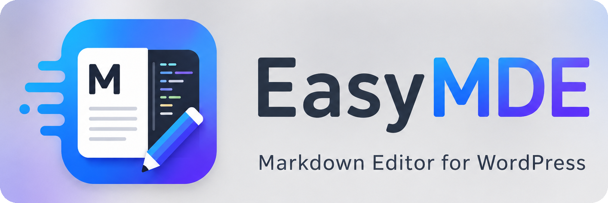
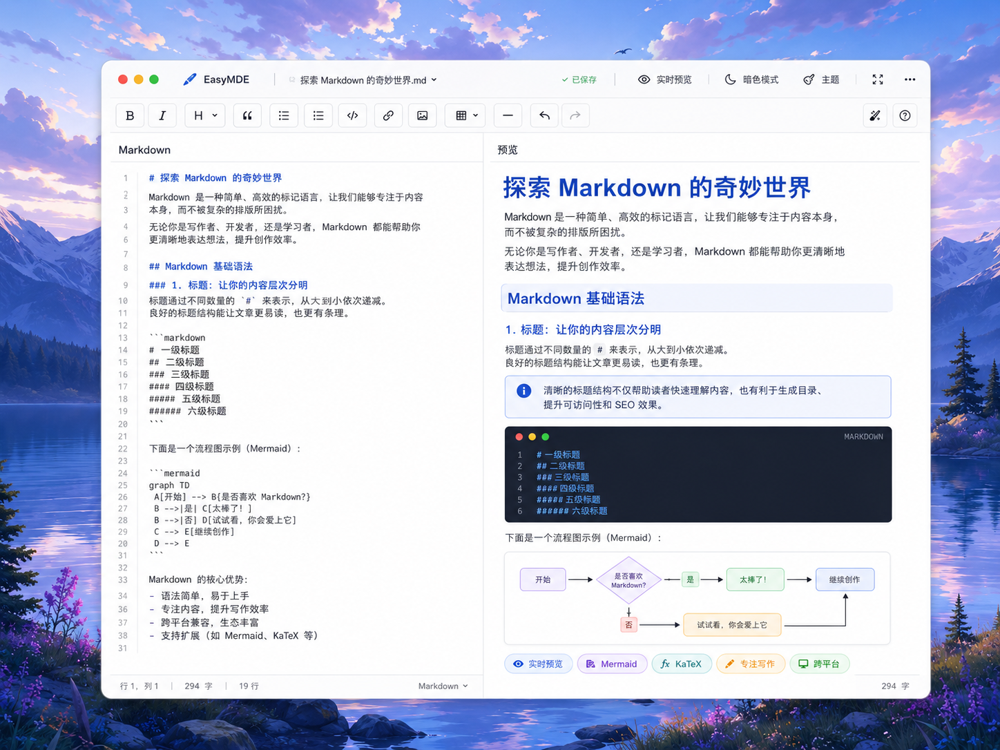

<p align="center">
  <a href="./docs/assets/easymde-logo-rounded.png">
    
  </a>
</p>
<h1 align="center">EasyMDE - WordPress Markdown 编辑器插件</h1>
<p align="center"> 专为 WordPress 打造的最好的 Markdown 编辑插件，获得极致沉浸的写作体验</p>
<p align="center">
  <a href="https://github.com/tao-xiaoxin/EasyMDE/releases">
    
  </a>
  
  
  <a href="https://github.com/tao-xiaoxin/EasyMDE/actions/workflows/ci.yml">
    
  </a>
  <a href="./LICENSE">
    
  </a>
</p>

<p align="center">简体中文 | <a href="README.en.md">English</a></p>

为内容创作者打造的新一代 WordPress Markdown 编辑器，支持实时预览、Mermaid 图表、KaTeX 公式、图床设置、原生发布、版本修订与微信公众号一键复制，让写作、排版与发布更加高效。

<p align="center">
  <a href="https://github.com/tao-xiaoxin/EasyMDE/releases/latest/download/EasyMDE.zip"><strong>下载插件</strong></a>
  · <a href="https://github.com/tao-xiaoxin/EasyMDE/releases/latest">最新发布</a>
</p>

<p align="center">
  <a href="./docs/assets/easymde-editor-showcase.png">
    
  </a>
</p>

## 要求

| 环境 | 要求 |
| --- | --- |
| WordPress | 6.7 或更高版本 |
| PHP | 7.4 或更高版本，并启用 DOM 扩展 |

## 安装

1. 下载 [GitHub Release](https://github.com/tao-xiaoxin/EasyMDE/releases/latest) 中的 `EasyMDE.zip`。
2. 在 WordPress 后台进入 **插件 > 安装插件 > 上传插件**，上传并启用 `EasyMDE.zip`。
3. 打开 **文章** 或 **页面**，开始用 Markdown 写作。

## 功能

### ✍️ 专注写作

- ✅ **支持分栏实时预览：** 源文档与预览窗格同步滚动。
- ✅ **专业的快捷工具栏：** 通过工具栏媒体选择器插入图片，Markdown 加粗等一键完成。
- ✅ **参考 Typora 风格快捷键：** 支持站点级 Windows/Linux 和 macOS 覆盖设置。
- ✅ **支持沉浸式编辑：** 沉浸式编辑器支持 `~~~` 或反引号围栏快捷输入代码块。
- ✅ **支持自动保存：** 支持草稿自动定时保存，永不丢失。
- ✅ **支持本地草稿恢复：** 可以明确处理恢复不同时间段的编辑草稿。
- ✅ **支持 Markdown 常用编辑语法：** 代码语法高亮、Mermaid 图表、KaTeX 公式。

### ⚙️ 设置中心

- ✅ **内置图床托管：** 支持 Cloudflare R2、七牛云 Kodo、阿里云 OSS、腾讯云 COS，可配置主/备目的地、文件名规则与上传重试。
- ✅ **支持快捷键自定义：** 工具栏快捷键可分别配置 Windows/Linux 与 macOS，自动检测冲突。
- ✅ **支持 Markdown 偏好：** 自动换行、GFM、智能标点、表格对齐、代码行号、粘贴为 Markdown。
- ✅ **支持通用偏好：** 自动保存间隔、编辑器主题应用到前台、已发布代码块复制按钮。
- ✅ **支持设置导入导出：** 一键迁移与备份全部偏好设置。

### 🎨 个性外观

- ✅ **内置10+字体样式：** 每篇文章独立选择**独立字体样式**。
- ✅ **支持代码复制：** 已发布文章默认显示代码块复制按钮，可按需隐藏。
- ✅ **内置40+文章主题和10+ 代码主题：** 每篇文章可以独立选择**文章主题**与**代码主题**，方便快捷的支持微信公众号复制导出发布。
- ✅ **支持自定义设置：** 外观可作用于已发布内容，也可仅用于编辑器预览。
- ✅ **支持自定义代码与文章主题样式：** 可按需定制并且自动下次保存复用代码与文章主题样式。

### 📤 发布与分享

- ✅ **一键复制发布到微信公众号：** 将当前预览以富文本粘贴到公众号编辑器。

## 技术文档

- [文档索引](docs/README.md)
- [用户指南](docs/USER_GUIDE.md)
- [开发设置](docs/DEVELOPMENT.md)
- [测试与发布](docs/TESTING_AND_RELEASE.md)
- [架构](docs/ARCHITECTURE.md)
- [Plugin Check 说明](docs/PLUGIN_CHECK.md)
- [升级说明](UPGRADING.md)
- [安全策略](SECURITY.md)
- [贡献指南](CONTRIBUTING.md)
- [WordPress 软件包 readme](readme.txt)
- [第三方声明](THIRD-PARTY-NOTICES.md)

## 开发

从以下命令开始：

```bash
composer install
npm install
npm run assets:check
```

更多请参阅 [开发设置](docs/DEVELOPMENT.md) 和 [测试与发布](docs/TESTING_AND_RELEASE.md)。

## 支持 EasyMDE

<p align="center">
  如果 EasyMDE 改善了你的 WordPress 写作流程，请你点个 Star 支持一下。
</p>

## 许可证

EasyMDE 使用 [Apache-2.0](LICENSE) 许可证。
