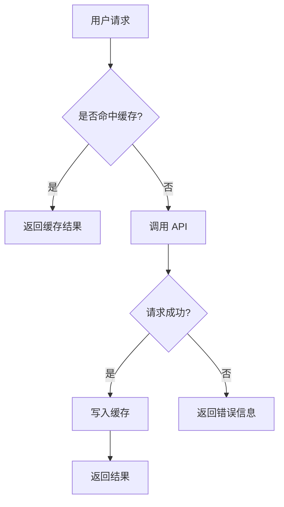
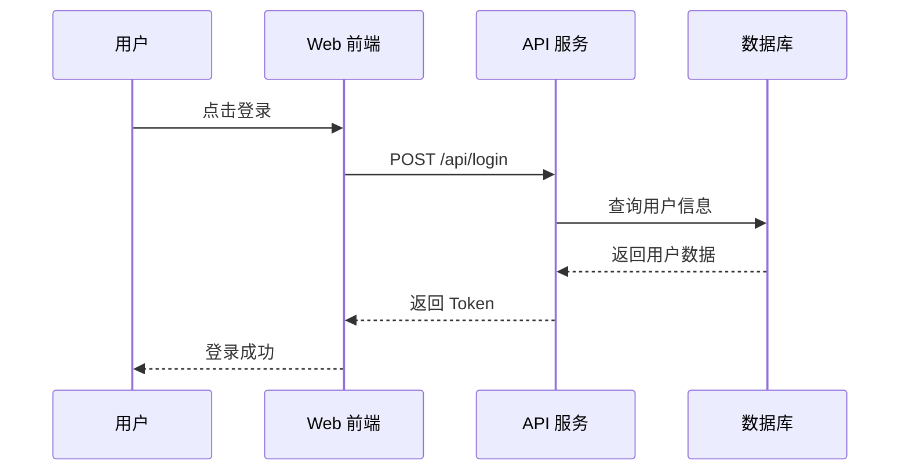
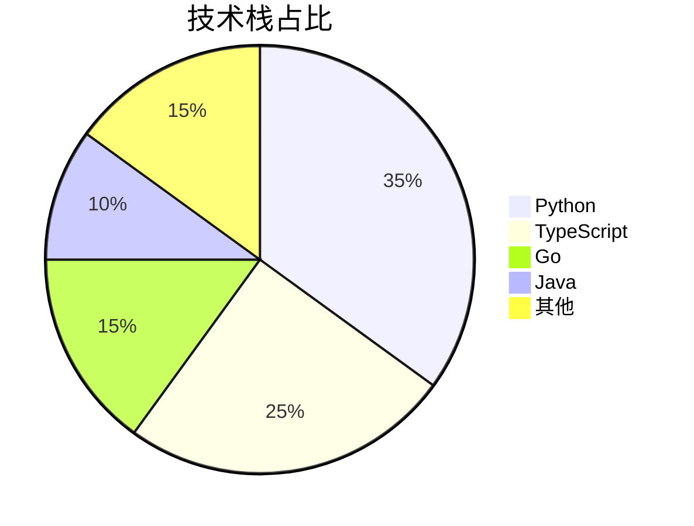
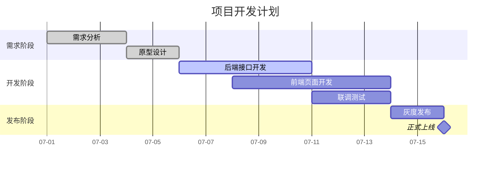
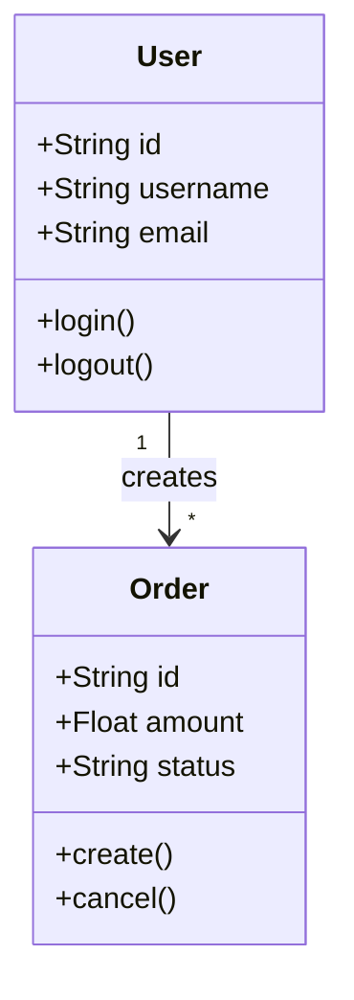
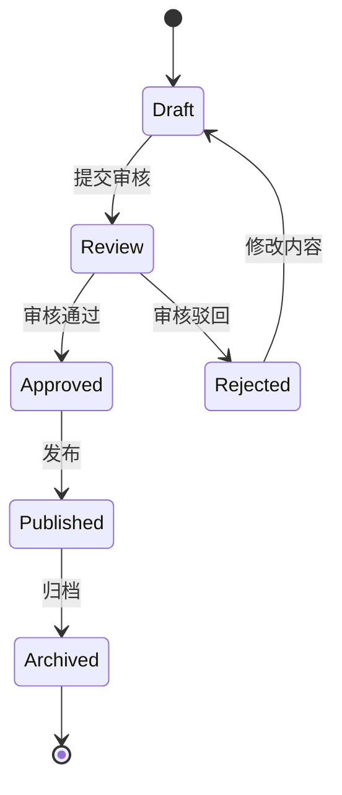
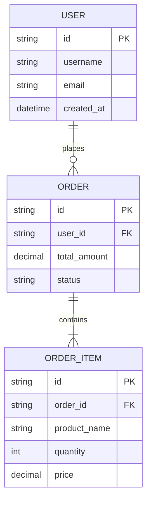
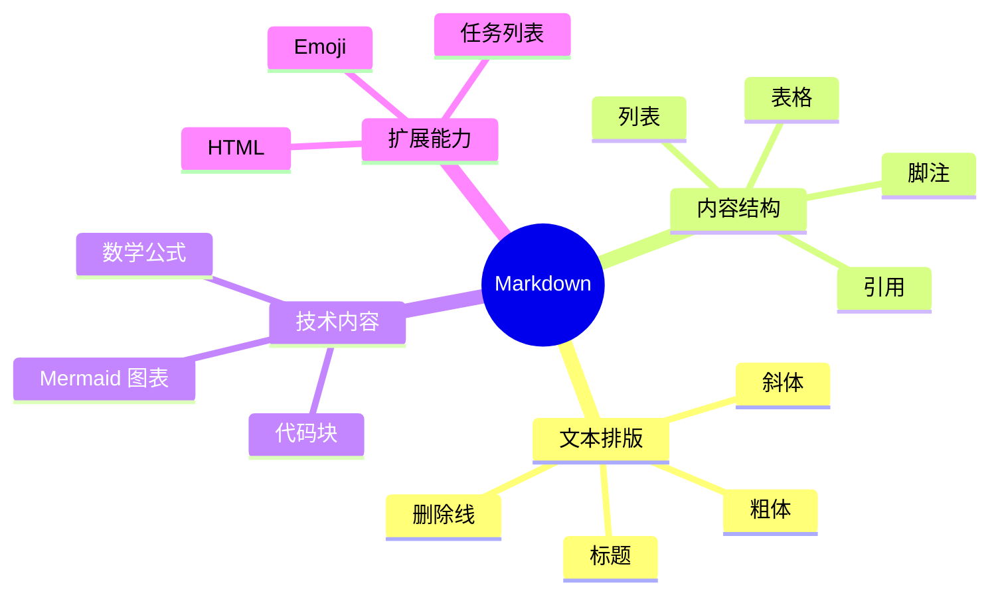
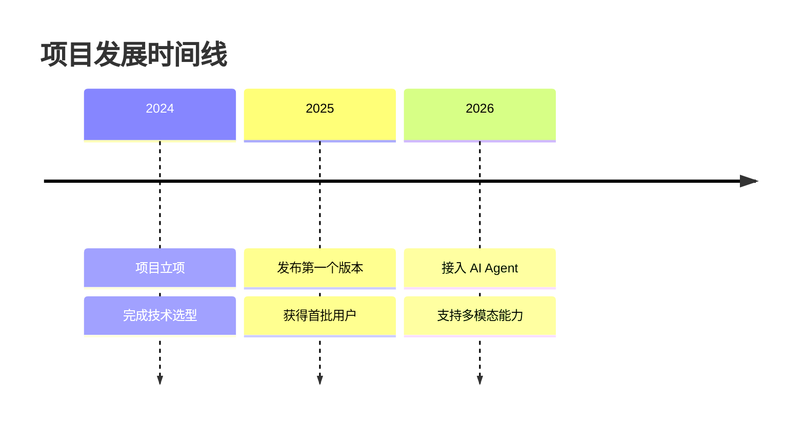
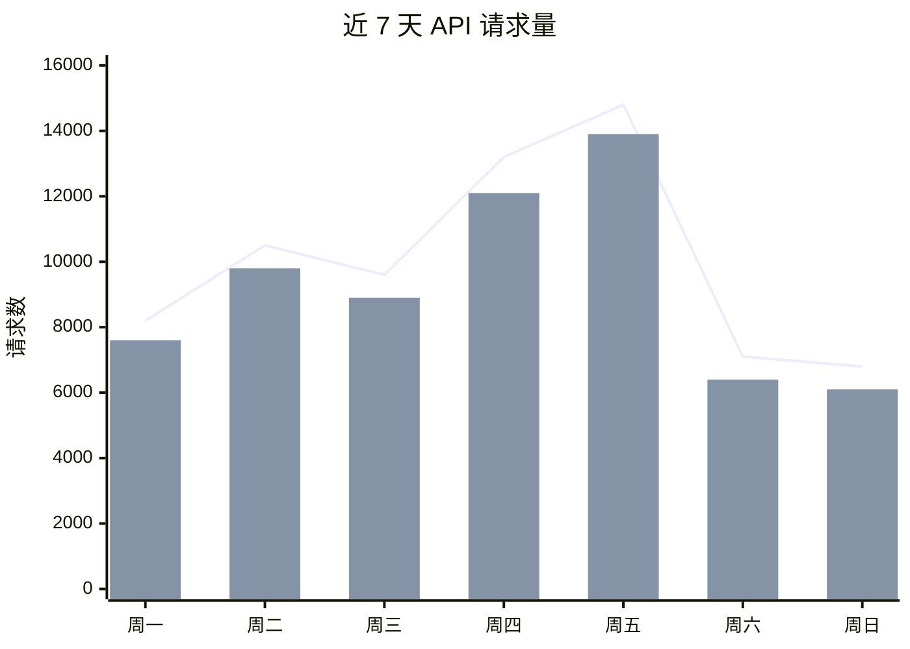

# Markdown 全量能力测试文档

> 用于测试标题、排版、表格、代码、数学公式、Mermaid 图表、HTML、脚注、任务列表等 Markdown 渲染能力。

---

## 1. 标题层级

# 一级标题 Heading 1

## 二级标题 Heading 2

### 三级标题 Heading 3

#### 四级标题 Heading 4

##### 五级标题 Heading 5

###### 六级标题 Heading 6

---

## 2. 文本样式

普通文本、**粗体文本**、*斜体文本*、***粗斜体文本***。

~~删除线文本~~、`行内代码`、<u>下划线文本</u>、<mark>高亮文本</mark>。

H<sub>2</sub>O、x<sup>2</sup>、© 2026、™、✓、⚠️、🚀。

支持 Emoji：😀 😎 🎉 🔥 💡 ✅ ❌ 📌 🧠 🤖

---

## 3. 链接与图片

[OpenAI 官网](https://openai.com)

自动链接：https://github.com

邮箱链接：[example@example.com](mailto:example@example.com)


带标题的图片：


---

## 4. 引用块

> 这是一级引用。
>
> Markdown 是一种轻量级标记语言。

> 嵌套引用示例：
>
> > 第二层引用。
> >
> > > 第三层引用。

> [!NOTE]
> 这是一个提示块，部分平台如 GitHub 支持。

> [!TIP]
> 这是一个技巧提示。

> [!WARNING]
> 这是一个警告提示。

> [!IMPORTANT]
> 这是一个重要提示。

---

## 5. 无序、有序与任务列表

### 无序列表

* 前端开发
* 后端开发

  * Python
  * Node.js
  * Go
* 运维部署

  * Docker
  * Nginx
  * Kubernetes

### 有序列表

1. 创建项目
2. 安装依赖
3. 编写代码
4. 运行测试
5. 部署上线

### 任务列表

* [x] 初始化仓库
* [x] 配置 Git
* [x] 编写 README
* [ ] 完成单元测试
* [ ] 配置 CI/CD
* [ ] 发布正式版本

---

## 6. 分隔线

---

---

---

---

## 7. 表格

| 名称       |   类型  |  状态 |    评分 |
| :------- | :---: | --: | ----: |
| GPT-5.5  |  推理模型 |  稳定 | ⭐⭐⭐⭐⭐ |
| Claude   |  对话模型 |  稳定 |  ⭐⭐⭐⭐ |
| Gemini   | 多模态模型 | 测试中 |  ⭐⭐⭐⭐ |
| DeepSeek |  推理模型 |  稳定 |  ⭐⭐⭐⭐ |

### 对齐测试表格

| 左对齐    |  居中 |    右对齐 |
| :----- | :-: | -----: |
| Apple  | 100 | $99.99 |
| Banana | 200 | $12.50 |
| Orange | 300 |  $8.88 |

### 单元格内代码与换行

| 模块   | 命令              | 说明              |
| ---- | --------------- | --------------- |
| 安装依赖 | `npm install`   | 安装项目依赖          |
| 启动开发 | `npm run dev`   | 启动本地服务<br>支持热更新 |
| 构建产物 | `npm run build` | 生成生产环境静态文件      |

---

## 8. 行内代码与代码块

行内代码示例：`const hello = "world";`

### Bash

```bash
#!/usr/bin/env bash

set -euo pipefail

echo "Hello, Markdown!"
mkdir -p ./dist
npm install
npm run build
```

### Python

```python
from dataclasses import dataclass
from typing import List


@dataclass
class User:
    name: str
    age: int


def greet(users: List[User]) -> None:
    for user in users:
        print(f"Hello, {user.name}! You are {user.age} years old.")


if __name__ == "__main__":
    greet([
        User(name="Xiaoxin", age=18),
        User(name="Alice", age=22),
    ])
```

### JavaScript / TypeScript

```ts
interface ApiResponse<T> {
  code: number;
  message: string;
  data: T;
}

async function fetchUser(id: string): Promise<ApiResponse<{ id: string; name: string }>> {
  const response = await fetch(`/api/users/${id}`);

  if (!response.ok) {
    throw new Error(`Request failed: ${response.status}`);
  }

  return response.json();
}
```

### JSON

```json
{
  "name": "markdown-test",
  "version": "1.0.0",
  "features": [
    "table",
    "math",
    "mermaid",
    "code-highlight"
  ],
  "enabled": true
}
```

### YAML

```yaml
name: markdown-test
version: 1.0.0

services:
  app:
    image: node:22-alpine
    ports:
      - "3000:3000"
    environment:
      NODE_ENV: production
```

### SQL

```sql
SELECT
  u.id,
  u.username,
  COUNT(o.id) AS order_count,
  SUM(o.amount) AS total_amount
FROM users u
LEFT JOIN orders o ON o.user_id = u.id
WHERE u.status = 'active'
GROUP BY u.id, u.username
ORDER BY total_amount DESC;
```

### Diff

```diff
- const port = 3000;
+ const port = process.env.PORT ?? 8080;

- console.log("Development mode");
+ console.log(`Server started at http://localhost:${port}`);
```

---

## 9. 数学公式

### 行内公式

爱因斯坦质能方程：$E = mc^2$

圆的面积：$S = pi r^2$

概率归一化：$sum_{i=1}^{n} p_i = 1$

### 独立公式

$$
int_a^b f(x),dx = F(b) - F(a)
$$

$$
frac{partial}{partial x} f(x, y)
===================================

lim_{Delta x to 0}
frac{f(x+Delta x, y)-f(x, y)}{Delta x}
$$

### 矩阵

$$
A =
begin{bmatrix}
1 & 2 & 3 
4 & 5 & 6 
7 & 8 & 9
end{bmatrix}
$$

### 方程组

$$
begin{cases}
x + y = 10 
2x - y = 5
end{cases}
$$

### 分段函数

$$
f(x) =
begin{cases}
x^2, & x geq 0 
-x^2, & x < 0
end{cases}
$$

### 常见统计公式

$$
mu = frac{1}{n}sum_{i=1}^{n}x_i
$$

$$
sigma = sqrt{frac{1}{n}sum_{i=1}^{n}(x_i-mu)^2}
$$

### 神经网络前向传播

$$
mathbf{h} = sigma(mathbf{W}mathbf{x} + mathbf{b})
$$

$$
hat{y} = text{softmax}(mathbf{W}_omathbf{h}+mathbf{b}_o)
$$

---

## 10. Mermaid 流程图



---

## 11. Mermaid 时序图



---

## 12. Mermaid 饼图



---

## 13. Mermaid 甘特图



---

## 14. Mermaid 类图



---

## 15. Mermaid 状态图



---

## 16. Mermaid ER 数据库关系图



---

## 17. Mermaid 思维导图



---

## 18. Mermaid 时间线



---

## 19. 折叠内容

<details>
<summary>点击展开查看隐藏内容</summary>

这里是默认折叠的内容。

* 可以放列表
* 可以放代码
* 可以放说明文字

```bash
echo "隐藏区域中的代码"
```

</details>

---

## 20. HTML 标签测试

<div align="center">

### 居中标题

这是一段通过 HTML `div` 实现居中的文本。

</div>

<p align="right">
这是右对齐文本。
</p>

<kbd>⌘</kbd> + <kbd>K</kbd>

<details>
<summary>HTML details 测试</summary>

支持 **Markdown 粗体**、`代码` 与列表：

1. 第一项
2. 第二项

</details>

---

## 21. 脚注

Markdown 支持脚注功能。[^1]

这里还有第二个脚注。[^long-note]

[^1]: 这是一个简单脚注。

[^long-note]: 这是一个较长的脚注内容，可用于补充说明、引用来源或备注信息。

---

## 22. 引用式链接

这是一个 [GitHub][github-link] 链接。

这是一个 [OpenAI][openai-link] 链接。

[github-link]: https://github.com "GitHub"
[openai-link]: https://openai.com "OpenAI"

---

## 23. 转义字符

*这不是斜体*

**这不是粗体**

# 这不是标题

`这不是代码`

---

## 24. 综合示例：AI 服务监控面板描述

### 服务状态

| 服务           | 地址                        |   状态  |  响应时间 |
| ------------ | ------------------------- | :---: | ----: |
| API Gateway  | `https://api.example.com` |  ✅ 正常 |  82ms |
| Redis Cache  | `redis://127.0.0.1:6379`  |  ✅ 正常 |   4ms |
| PostgreSQL   | `postgres://db:5432`      |  ✅ 正常 |  12ms |
| Worker Queue | `amqp://rabbitmq:5672`    | ⚠️ 延迟 | 420ms |

### 核心指标

* QPS：`1,284`
* 错误率：`0.12%`
* P95 延迟：`238ms`
* CPU 使用率：`42%`
* 内存使用率：`61%`



### 错误率计算

$$
text{Error Rate}
=================

frac{text{Failed Requests}}{text{Total Requests}}
times 100%
$$

例如：

$$
frac{12}{10000} times 100% = 0.12%
$$

---

## 25. 最终测试清单

* [x] 标题
* [x] 文本格式
* [x] 图片与链接
* [x] 引用块
* [x] 列表与任务清单
* [x] 表格
* [x] 多语言代码块
* [x] 数学公式
* [x] Mermaid 图表
* [x] HTML 标签
* [x] 脚注
* [x] 折叠内容
* [x] Emoji 与特殊字符

> 测试完成。若某一部分没有正常显示，通常说明当前 Markdown 渲染器未启用对应扩展，例如 KaTeX、Mermaid、HTML 或 GitHub Flavored Markdown。
